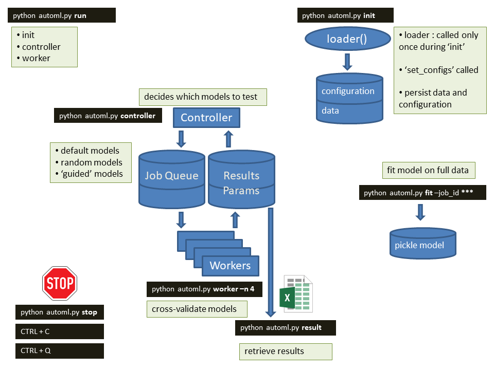

.. _auto_ml_overview:

Auto ML Overview
================

aikit proposes a tool to automatically search among machine learning models and preprocessings to find the best one(s).

To do that the algorithm needs an 'X' DataFrame and a target 'y' and that is it. The algorithm starts to guess everything that is needed:

 * the type of problem (regression, classification)
 * the type of each variable (categorical, text or numerical)
 * the models/transformers to use
 * the scorer to use
 * the type of cross-validation to use
 * ...
 
Everything can be overrided by the the user if needed.
(See detailed doc after).

A folder also needs to be set because everything will transit on disk and be saved in that folder.

Once everything is set a job controller should be launched. Its job will be to create new models to try.
Then, one (or more) workers should be launched to actually do the job and test the model.

After a while the result can be seen and a model can be chosen.

The process is more or less the following (see after for detailed)

 1. the controller creates a random model (see detailed after)
 2. one worker picks up that model and cross validates it
 3. the controller picks up the result to help drive the random search
 4. after a while the result can be aggregated to choose the model
 
Everything can be driven via a script.

Launcher
--------

The easiest way to start the auto ml is to create a script like the following one (and save it as 'automl_launcher.py' for example)

Example::

    from aikit.datasets import load_dataset, DatasetEnum
    from aikit.ml_machine import MlMachineLauncher

    def loader():
        """ modify this function to load the data

        Returns
        -------
        dfX, y

        Or
        dfX, y, groups

        """
        dfX, y, *_ = load_dataset(DatasetEnum.titanic)
        return dfX, y

    def set_configs(launcher):
        """ modify that function to change launcher configuration """

        launcher.job_config.score_base_line = 0.75
        launcher.job_config.allow_approx_cv = True

        return launcher

    if __name__ == "__main__":
        launcher = MlMachineLauncher(base_folder = "C:/automl/titanic", 
                                     name = "titanic",
                                     loader = loader,
                                     set_configs = set_configs)

        launcher.execute_processed_command_argument()

The only thing to do is to replace the loader function by a function that loads your own data.
Once that is done, just run the following command ::

    python automl_launcher.py run -n 4

It will starts the process using 4 workers (you can change that number if you have more or less processes available).

Here is a diagram that summarize what is going and explained the different functionnalities.
For a complete explanation of all the command please look at the :ref:`ml_machine_launcher` page.

