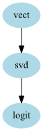
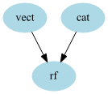
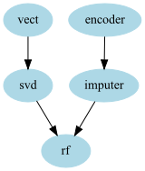
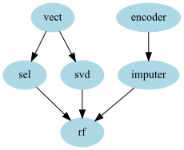

.. _graph_pipeline:

GraphPipeline
=============

The GraphPipeline object is an extension of :class:`sklearn.pipeline.Pipeline` but the transformers/models can be chained with any directed graph.

The objects takes as input two arguments:
 * models : dictionary of models (each key is the name of a given node, and each corresponding value is the transformer corresponding to that node)
 * edges  : list of tuples that link the nodes to each other

The created object will behave like a regular sklearn model : 
 * it can be cloned and thus cross-validated
 * it can pickled
 * set and get params works
 * it can obviously be fitted and returns predictions
 * ...
 

Example::

    gpipeline = GraphPipeline(models = {"vect" : CountVectorizerWrapper(analyzer="char",ngram_range=(1,4)),
                                            "svd"  : TruncatedSVDWrapper(n_components=400) , 
                                            "logit" : LogisticRegression(class_weight="balanced")},
                                   edges = [("vect","svd","logit")]
                                   )
                                   
This is a model on which we do the following steps:
 1. do a Bag of Char CountVectorizer
 2. apply an SVD on the result
 3. fit a Logistic Regression on the result
 
The edges parameters just says that there are edges from "vect" to "svd" to "logit". 
By convention if a tuple is of length more than 2 it is assumed that all consecutive elements forms an edge (same convention as in DOT graph language)

This model could have be built using sklearn Pipeline. If :mod:`graphviz` is installed you can get a nice vizualization of the graph using::

    gpipeline.graphviz

Now the aims of the GraphPipeline object is to be able to handle more complexe chaining of transformers. 
Let's assume that you have 2 texts columns in your dataset "Text1","Text2" and 2 categorical columns "Cat1","Cat2" and that you want to do the following:
 * CountVectorizer on your text
 * Categorical Encoder on your categories
 * merging the 2 encoded variables and give the result to a :class:`RandomForestClassifier`
 
You would need to create a GraphPipeline like that::

    gpipeline = GraphPipeline(models = {"vect" : CountVectorizerWrapper(analyzer="char",ngram_range=(1,4), columns_to_use=["text1","text2"]),
                                        "cat"  : NumericalEncoder(columns_to_use=["cat1","cat2"]) , 
                                        "rf"   : RandomForestClassifier(n_estimators=100)}  ,
                                   edges = [("vect","rf"),("cat","rf")]
                                   )

Note that this time, the edges parameters tells that there are 2 edges : "vect" to "rf" and "cat" to "rf"

   

This particular graph could have been built using a combination of :class:`sklearn.pipeline.Pipeline` and :class:`sklearn.pipeline.FeatureUnion`, however the syntax is easier here.

Let's take a slightly more complexe exemple::

    gpipeline = GraphPipeline(models = {"encoder" : NumericalEncoder(columns_to_use = ["cat1","cat2"]),
                                        "imputer" : NumImputer(),
                                        "vect"    : CountVectorizerWrapper(analyzer="word",columns_to_use=["cat1","cat2"]),
                                        "svd"     : TruncatedSVDWrapper(n_components=50),
                                        "rf"      : RandomForestClassifier(n_estimators=100)
                                            },
                            edges = [("encoder","imputer","rf"),("vect","svd","rf")] )

   
In that example we have 2 chains of transformers :
 * one for the text on which we apply a CountVectorizer and then do an SVD
 * one for the categorical variable that we encode and then input the missing values
 
Now let's take one last example of something that couldn't be done using FeatureUnion and Pipeline without computing some transformations twice. 

Imagine that you want the RandomForestClassifier to have both the CountVectorizer features and the SVD features, using the Graphpipeline you can do the following model::
You can do that by just adding another edge between "vect" and "rf"::

    gpipeline = GraphPipeline(models = {"encoder" : NumericalEncoder(columns_to_use = ["cat1","cat2"]),
                                        "imputer" : NumImputer(),
                                        "vect"    : CountVectorizerWrapper(analyzer="word",columns_to_use=["cat1","cat2"]),
                                        "svd"     : TruncatedSVDWrapper(n_components=50),
                                        "rf"      : RandomForestClassifier(n_estimators=100)
                                            },
                            edges = [("encoder","imputer","rf"),("vect","rf"),("vect","svd","rf")] )

.. figure:: img/graphpipeline_complexepipe2.png
   :alt: graphviz vizualization of a more complexe pipeline

A variation of that would be to include a node to select feature after the CountVectorizer, that way you could :
 * keep the most important text features *as is*
 * retain some of the other information but reduce the dimension via an SVD
 * keep the other features
 * feed everything to a given model
 
So code would be::

    gpipeline = GraphPipeline(models = {"encoder" : NumericalEncoder(columns_to_use = ["cat1","cat2"]),
                                        "imputer" : NumImputer(),
                                        "vect"    : CountVectorizerWrapper(analyzer="word",columns_to_use=["cat1","cat2"]),
                                        "sel"     : FeaturesSelectorClassifier(n_components = 25),
                                        "svd"     : TruncatedSVDWrapper(n_components=50),
                                        "rf"      : RandomForestClassifier(n_estimators=100)
                                            },
                            edges = [("encoder","imputer","rf"),("vect","sel","rf"),("vect","svd","rf")] )

Other input syntaxes
--------------------

To make things easier for the user, other type of inputs are accepted.
The models arguments can also be :
 * a list of 2-tuple
 * an OrderedDict
 
The edges arguments can be omitted when the GraphPipeline is indeed a *regular* (linear) pipeline. In that case the models arguments can't be a dictionnary (which doesn't have any order) but should instead be a list or an OrderedDict

(Remark : no matter the syntaxes used, GraphPipeline uses an internal "_models" dictionnary to store the models at each node and an internal "_edges" attribute to saved the edges. 
So if the classical syntaxe wasn't not used you can still access the models if needed).

Example::

    gpipeline = GraphPipeline(models = [( "vect" , CountVectorizerWrapper(analyzer="char",ngram_range=(1,4)) ),
                                        ( "svd"   , TruncatedSVDWrapper(n_components=400) ), 
                                        ( "logit" , LogisticRegression(class_weight="balanced") )] )
                                        
which gives the same pipeline as the first example:

   
Edges can also be specify using DOT like format: 
 * "A - B" : edge from A to B
 * "A - B - C" : edge from A to B to C
 * "A - C ; B - C" : edge from A to C and from B to C
 

   
Merging nodes
-------------
The GraphPipeline automatically knows how to merge data of different types. For example the output of a CountVectorizer is most of time a sparse matrix whereas the output of an encoder usually is a DataFrame or a numpy array.
This is the case for the pipeline 

   
before applying the RandomForest a concatenation should be made. The GraphPipeline uses the generic concatenation functions :func:`aikit.data_structure_helper.generic_hstack` to handle that.

Remark : in some cases you don't want the model to handle concatenation, for example because you want to treat the two (or more) inputs separately yourself in the following transformer.
In that case you can add specify the argument *no_concat_nodes* to specify the nodes at which you don't want the GraphPipeline to concatenate.
In that case the following node will receive a **dictionnary of transformed data** the keys are the name of the preceding nodes and the values the corresponding transformations.

Remark : the order on which the node appear in the graphviz representation is not necessary the order of the concatenation of the features made within the GraphPipeline.
The order of concatenation is actually fixed by the order of the edges : the first node that appear within the edges will be on the *left* of the concatenated data.

Exposed methods
---------------
The GraphPipeline exposed the methods that are available in the final node of the estimator (Pipeline is doing exactly the same). For example
 * if the final estimator has a decision_functions method, the GraphPipeline will be able to call it (applying transformations on each node and then decision_function on the final node)
 * if that is not the case an AttributeError will be raised

Features Names
--------------
The GraphPipeline also makes it easier to handle features names.
Indeed when using it the names of the features are passed down the pipeline using the "get_feature_names" of each node and whenever possible using the "input_features" argument to tell each node the name of the features in input.
That way each node *knows* the name of the feature it has as input and can *give* the names of its features.
Those name are used are columns names whenever a DataFrame is retrieved.

You can also retrieve the features at each node if needed (for Example to look at features importances on the last node). The two methods to do that are:

 * get_feature_names_at_node  : retrieve the name of the features at the **exit** of a given node
 * get_input_features_at_node : retrive the name of the features at the **entry** of a given node (this can be called at the last node to know to which features corresponds which feature importance for example)
 
 

 
Complete Documentation
----------------------
.. autoclass:: aikit.pipeline.GraphPipeline

