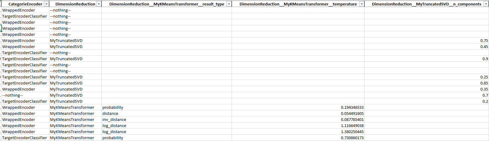
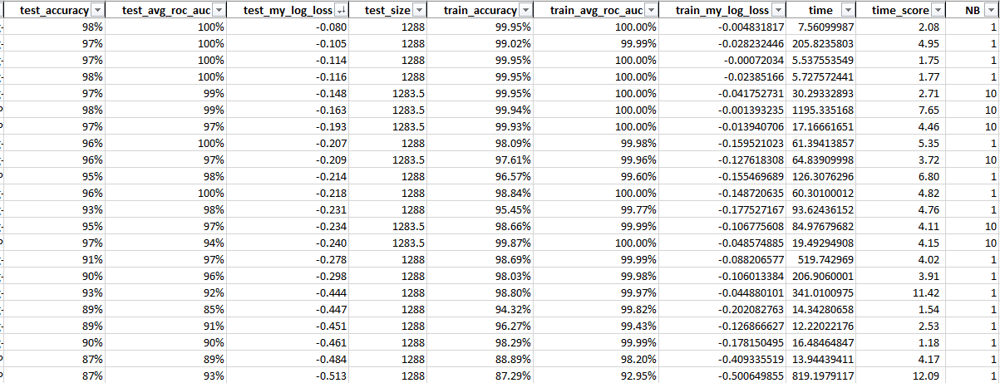

.. _ml_machine_details:

Ml Machine Overview
===================

aikit proposes a tool to automatically search among machine learning models and preprocessings to find the best one(s).

To do that the algorithm needs an 'X' DataFrame and a target 'y' and that is it. The algorithm starts to guess everything that is needed:

 * the type of problem (regression, classification)
 * the type of each variable (categorical, text or numerical)
 * the models/transformers to use
 * the scorer to use
 * the type of cross-validation to use
 * ...
 
Everything can be overrided by the the user if needed.
(See detailed doc after).

A folder also needs to be set because everything will transit on disk and be saved in that folder.

Once everything is set a job controller should be launched. Its job will be to create new models to try.
Then, one (or more) workers should be launched to actually do the job and test the model.

Here is more or less what goes on:

 1. the controller creates a random model (see detailed after)
 2. one worker picks up that model and cross validates it
 3. the controller picks up the result to help drive the random search
 4. after a while the result can be aggregated to choose the model
 
 
Simple Launch
-------------

Here are the steps to launch a test.
For simplicity you can also use an :class:`MlMachineLauncher` object (see _ml_machine_launcher)

Load a dataset 'dfX' and its target 'y' and decide a 'name' for the experiment. Then create an :class:`AutoMlConfig` object::

    from aikit.ml_machine import AutoMlConfig, JobConfig
    auto_ml_config = AutoMlConfig(dfX=dfX, y=y, name=name)
    auto_ml_config.guess_everything()
    
This object will contain all the configurations of the problem.
Then create a :class:`JobConfig` object::

    job_config = JobConfig()
    job_config.guess_cv(auto_ml_config=auto_ml_config, n_splits=10)
    job_config.guess_scoring(auto_ml_config=auto_ml_config)
    
The data (dfX and y) can be deleted from the AutoMlConfig after everything is guessed to save memory::

    auto_ml_config.dfX = None
    auto_ml_config.y = None

If you have an idea of a base line score you can set it::

    job_config.score_base_line = 0.95

Create a :class:`DataPersister` object (for now only a :class:`FolderDataPersister` object is available but other persisters using database should be possible)::

    from aikit.ml_machine import FolderDataPersister
    base_folder = "automl_folder_experiment_1"
    data_persister = FolderDataPersister(base_folder=base_folder)
    
    
Now everything is ready, a :class:`JobController` can be created and started (this controller can use a :class:`AutoMlModelGuider` to help drive the random search)::

    from aikit.ml_machine import AutoMlResultReader, AutoMlModelGuider, MlJobManager, MlJobRunner
    result_reader = AutoMlResultReader(data_persister)

    auto_ml_guider = AutoMlModelGuider(result_reader=result_reader,
                                       job_config=job_config,
                                       metric_transformation="default",
                                       avg_metric=True)
    
    job_controller = MlJobManager(auto_ml_config=auto_ml_config,
                                job_config=job_config,
                                auto_ml_guider=auto_ml_guider,
                                data_persister=data_persister)
                                
                                
Same thing one (or more workers) can be created::
    
    job_runner = MlJobRunner(dfX=dfX,
                       y=y,
                       auto_ml_config=auto_ml_config,
                       job_config=job_config,
                       data_persister=data_persister)
                       
                       
To start the controller just do::

    job_controller.run()
    
To start the worker just do::

    job_runner.run()

Remark : 
 * the runner and the worker(s) should be started seperately (for example the controller in a special thread, or in a special process).
 * the controller doesn't need the data (dfX and y) and they can be deletted from the :class:`AutoMlConfig` after everything is guessed 

Result Aggregation
------------------

After a while (whenever you want actually) you can aggregate the results and see them.
The most simple way to do that is to aggregate everything into an Excel file.
Create an :class:`AutoMlResultReader`::

    from aikit.ml_machine import AutoMlResultReader, FolderDataPersister
    
    base_folder = "automl_folder_experiment_1"
    data_persister = FolderDataPersister(base_folder = base_folder)
    
    result_reader = AutoMlResultReader(data_persister)
    

Then retrieve everything::

    df_results = result_reader.load_all_results()
    df_params  = result_reader.load_all_params()
    df_errors  = result_reader.load_all_errors()

 * df_results is a DataFrame with all the results (cv scores)
 * df_params is a DataFrame with all the parameters of each models
 * df_error is a DataFrame with all the errors that arises when fitting the models

Everything is linked by the 'job_id' column and can be merged::

    df_merged_result = pd.merge(df_params, df_results, how="inner", on="job_id")
    df_merged_error  = pd.merge(df_params, df_errors , how="inner", on="job_id")
    

And saved into an Excel file::

    df_merged_result.to_excel(base_folder + "/result.xlsx", index=False)
    
Result File
-----------

.. figure:: img/excel_result_file.bmp
   :alt: automl result file
   :target: _images/excel_result_file.bmp
   
Here are the parts of the file:

 * job_id : idea of the current model (this is id is used everywhere)
 * hasblock_** columns : indicate whether or not a given block of column were used
 * steps columns indicating which transformer/model were used for each step (Example : "CategoricalEncoder":"NumericalEncoder")
 * hyper-parameter columns : indicate the hyperparameters for each model/transformers
 * test_** : scoring metrics on testing data (ie: out of fold)
 * train_** : scoring metrics on training data (ie: in fold)
 * time, time_score : time to fit and score each model
 * nb : number of fold (not always max because sometime we don't do the full crossvalidation if performance are not good)
 

      

   
 

