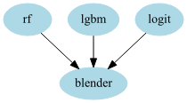
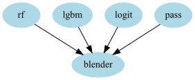
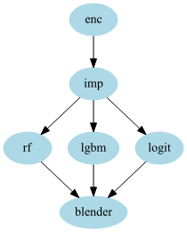
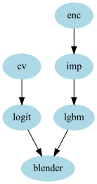
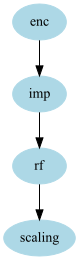

.. _model_stacking:

Model Stacking
==============

Here you'll find the explanation about how to fit stacking models using aikit.

Stacking How To
---------------

Stacking (or Blending) is done when you want to aggregate the result of several models into an aggregated prediction.
More precisely you want to use the predictions of the models as input to another blending model.
(In what follows I'll call *models* the models that we want to use as features and *blender* the model that uses those as features to make a final predictions)

To prevent overfitting you typically want to use out-sample predictions to fit the blender (otherwise the blender will just learn to trust the model that overfit the most...).

To generate out-sample predictions you can do a cross-validation:

for fold (i) and a given model :
    1. fit model on all the data from the other folds (1,...,i-1,i+1, .. N)
    2. call fitted model on data from fold (i) 
    3. store the predictions
    
If that is done on all the folds, you can get predictions for every sample in your database, but each prediction were generated using out sample training set.

Now you can take all those predictions and fit a blender model.

StackerClassifier
-----------------

This class does exactly what is describeb above. It takes as input a list of un-fitted models as well as a blending model and will generate a stacking model.
In that case what is given to the blending model are the probabilities of each class for each model.

 .. autoclass:: aikit.models.stacking.StackerClassifier
 
StackerRegressor
----------------

Same class but for regression problems

 .. autoclass:: aikit.models.stacking.StackerRegressor

OutSamplerTransformer
--------------------

The library offers another way to create stacking model. A stacking model can be viewed as another kind of pipeline : instead of a *transformation* it just uses other models as a special kind of transformers.
And so GraphPipeline can be used to chain this transformation with a blending model.

To be able to do that two things are needed:
    1. a model is not a transformer, and so we need to transform a model into a transformer (basically saying that the :function:`transform` method should use :function:`predict` or :function:`predict_proba`)
    2. to do correct stacking we need to generate out-sample predictions

The :class:`OutSamplerTransformer`  does just that. It takes care of generating out-sample predictions, and the blending can be done in another node of the GraphPipeline (see example bellow)

 .. autoclass:: aikit.models.stacking.OutSamplerTransformer 

Example
-------

Let's say we want to stack a RandomForestClassifier, an LGBMClassifier and a LogisticRegression. 
You can create the model like that::

    stacker = StackerClassifier( models = [RandomForestClassifier() , LGBMClassifier(), LogisticRegression()],
                                 cv = 10,
                                 blender = LogisticRegression()
                                )
    
and then fit it as you would a regular model::

    stacker.fit(X, y)

Using OutSamplerTransformer we can achieve the same thing but with a Pipeline instead::

    from sklearn.model_selection import StratifiedKFold
    from aikit.models import OutSamplerTransformer
    from aikit.pipeline import GraphPipeline
    cv = StratifiedKFold(10, shuffle=True, random_state=123)

    stacker = GraphPipeline(models = {
        "rf"   : OutSamplerTransformer(RandomForestClassifier() , cv = cv),
        "lgbm" : OutSamplerTransformer(LGBMClassifier()         ,  cv = cv),
        "logit": OutSamplerTransformer(LogisticRegression()     , cv = cv),
        "blender":LogisticRegression()
        }, edges = [("rf","blender"),("lgbm","blender"),("logit","blender")])

Remark: 
    1. the 2 models are equivalents
    2. to have *regular* stacking the same cvs should be used every where (either by creating it before hand, by setting the random state or using a non shuffle cv)

 
With this idea we can do more complicated things like :
    1. *deep* stacking with more than one layer : simply add other layer to the GraphPipeline
    2. create a blender that uses both predictions of models as well as the features (or part of it) : simply add another node linked to the blender (a PassThrough node for example)
    3. do pre-processing before doing any stacking (and so doing it out-side of the cv loop)

For example::

    stacker = GraphPipeline(models = {
        "rf"   : OutSamplerTransformer(RandomForestClassifier() , cv = cv),
        "lgbm" : OutSamplerTransformer(LGBMClassifier() , cv = cv),
        "logit": OutSamplerTransformer(LogisticRegression(), cv = cv),
        "pass" : PassThrough(),
        "blender":LogisticRegression()
        }, edges = [("rf","blender"),
                    ("lgbm","blender"),
                    ("logit","blender"),
                    ("pass", "blender")
                    ])

   
Or::

    stacker = GraphPipeline(models = {
        "enc"  : NumericalEncoder(),
        "imp"  : NumImputer(),
        "rf"   : OutSamplerTransformer(RandomForestClassifier() , cv = cv),
        "lgbm" : OutSamplerTransformer(LGBMClassifier() , cv = cv),
        "logit": OutSamplerTransformer(LogisticRegression(), cv = cv),
        "blender":LogisticRegression()
        }, edges = [("enc","imp"),
                    ("imp","rf","blender"),
                    ("imp","lgbm","blender"),
                    ("imp","logit","blender")
                    ])

And lastly::

    stacker = GraphPipeline(models = {
        "enc"  : NumericalEncoder(columns_to_use= ["cat1","cat2","num1","num2"]),
        "imp"  : NumImputer(),
        "cv"   : CountVectorizerWrapper(columns_to_use = ["text1","text2"]),
        "logit": OutSamplerTransformer(LogisticRegression(), cv = cv),
        "lgbm" : OutSamplerTransformer(LGBMClassifier() , cv = cv),
        "blender":LogisticRegression()
        }, edges = [("enc","imp","lgbm","blender"),
                    ("cv","logit","blender")
                    ])
                    

This last example shows a model where you have:
 * categorical and numerical data, on which you apply a classical categorie encoder, you fill missing value and use gradient boosting
 * textual data which you can encode using a CountVectorizer and use LogisticRegression
 
Both models can be mixted with a Logistic Regression blending. Doing that just create an average between the predictions, the only difference is that since the blender is fitted, weights are in a sence optimal.
(In some cases it might work better than just concatenate everything : especially since the 2 sets of features are highly different).

Another thing that can be done is to *calibrate probabilities*. This can be useful if your model generate meaningful scores but you can't directly interprete those scores as probabilities:
 * if you skewed your training set to solve imbalance
 * if your model is not probabilistic
 * ...
 
One method to re-calibrate probabilities, call `Platt's scaling <https://en.wikipedia.org/wiki/Platt_scaling/>`_ , is to fit a LogisticRegression on the output of your model.
If your predictions are not completely wrong, this will usualy just compute an increasing function that recalibrate your probabilities but won't change change the ordering of the output.
(roc_auc won't be affected, but logloss, or accuracy can change).

This can also be done using :class:`OutSamplerTransformer`::

    rf_rescaled = GraphPipeline(models = {
        "enc"  : NumericalEncoder(),
        "imp"  : NumImputer(),
        "rf"   : OutSamplerTransformer( RandomForestClassifier(class_weight = "auto"), cv = 10),
        "scaling":LogisticRegression()
        }, edges = [('enc','imp','rf','scaling')]
    )

   
OutSamplerTransformer regression mode
-------------------------------------
You can do exactly the same thing but for regresion tasks, only difference is that cross-validation uses :func:`predict` instead of :func:`predict_proba`.

ErrorBasedBlender
-----------------

(This is still experimental) When doing stacking, *usualy* what is done is : takes all the predictions of models and try to fit a blending model to predict the target.. This is by far the most classical solution.
Sometimes you can also incorporate the original features into the mix.

This is fine but you might want to do another thing. 
Instead of predicting the target you can predict the error of a given model => Ej = (Y - Yj)**2 (where Yj is the prediction of algorithm j).

That model can take features as input : Ej = Ej(X)

On test data, you can use the Error estimation to create weight of the different prediction.

wj = 1/Ej / sum Ei.

And predict Y = sum wj * Yj

That way you might have something more robust, because even if you're blender isn't capable of learning anything you will generate a prediction that is a weighted average of your individual prediction.
And if there are really zones of space where one model is better than the other you can learn it as well.

(Remark : the weight formula assumes independant prediction... we could also estimate covariance between individual model predictions and get other optimal weights : leveraging on the idea that the weights of correlated prediction are less valuable than un-correlated one).

The model :class:`ErrorBasedBlender` does just that. It takes as input a matrix X where the first 'meta_feature_size' are the original features (or a subset of those) and the rest are individual predictions.
It also take a 'model' attribute which is the model to use to predict the error.
(For stability the model actually predict log(epsilon + error) )

 .. autoclass:: aikit.models.stacking.ErrorBasedBlender 

    