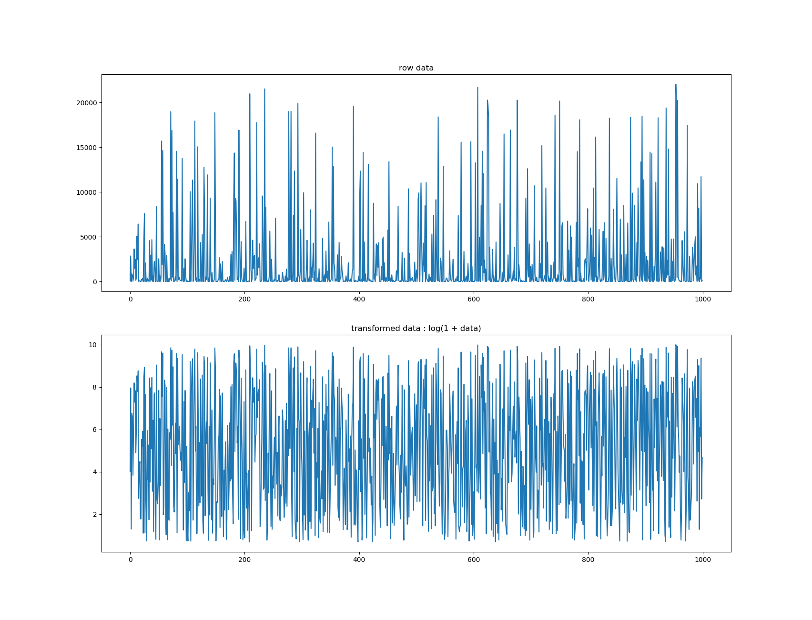
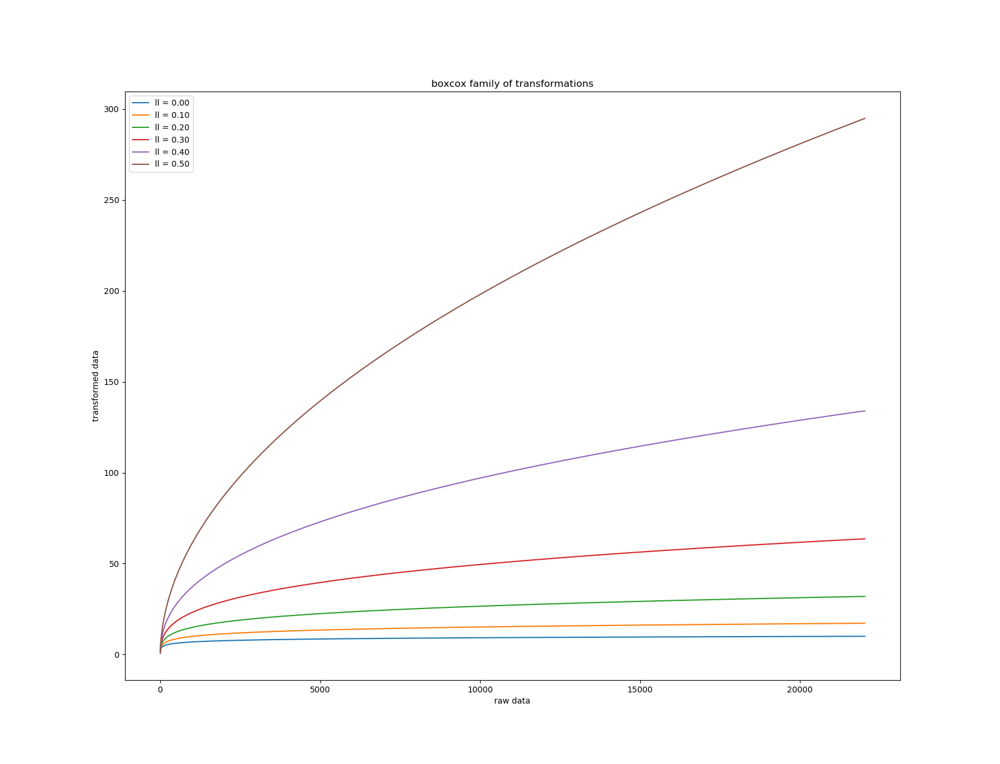

.. _transformers:

Transformers
============

aikit offers some transformers to help process the data. Here is a brief description of them.

Wrapped Transfomers
-------------------

Those transformers are just relatively thin wrappers around what already exists within sklearn, the aim is to facilitate integration and facilitate the automatic search amongst those transformers (See :ref:`ml_machine`)

The idea of those wrappers is to offer a little more than what is done by plain sklearn models:

 - automatic conversion of input/output into a given format (which is useful when chaining models, because some models accept DataFrames, some don't, some accept sparse data, some don't ...)
 - verification of type, shape of new data
 - shape conversion for model that only accept '1-dimensional' input
 - automatic splits and concatenation of results for models that only work one column at a time (See: :ref:`aikit.transformers.CountVectorizerWrapper`)
 - better handling of features names, get_feature_names method present everywhere, usage of those names for columns when the output is a DataFrame
 - delay the creation of underlying model until the :func:`fit` is called. This allow to customize hyper-parameters based on the data (Ex : ``n_components`` can be a float).
 
All those models are wrapped using :class:`aikit.transformers.model_wrapper.ModelWrapper`. A complete explanation of how to wrap new models is present there

Text Transformer
----------------

TextDigitAnonymizer
*******************

 .. autoclass:: aikit.transformers.text.TextDigitAnonymizer
 

TextNltkProcessing
*******************

This is another text pre-processing transformers that does classical text transformations.

 .. autoclass:: aikit.transformers.text.TextNltkProcessing
 
CountVectorizerWrapper
*****************

Wrapper around sklearn ``CountVectorizer``.

 .. autoclass:: aikit.transformers.text.CountVectorizerWrapper

Word2VecVectorizer
******************

This model does *Continuous bag of word*, meaning that it will fit a Word2Vec model and then average the word vectors of each text.

 .. autoclass:: aikit.transformers.text.Word2VecVectorizer

Char2VecVectorizer
******************

This model is the equivalent of a "Bag of N-gram" characters but using embedding. It is fitting embedding for sequence of caracters and then average all those embeddings.

 .. autoclass:: aikit.transformers.text.Char2VecVectorizer

Dimension Reduction
-------------------

TruncatedSVDWrapper
**************

Wrapper around sklearn ``TruncatedSVD``.

 .. autoclass:: aikit.transformers.base.TruncatedSVDWrapper

KMeansTransformer
*******************
This transformers does a KMeans clustering and uses the cluster to generate new features (based on the distance between each cluster).
Remark : for the 'probability' result_type, since KMeans isn't a probabilistic model the probability is computed using an heuristic.

 .. autoclass:: aikit.transformers.base.KMeansTransformer
 

Feature Selection
-----------------

FeaturesSelectorRegressor
***************************

This transformer will perform feature selection.
Different strategies are available:
 - "default" : uses sklearn default selection, using correlation between target and variable
 - "linear"  : uses absolute value of scaled parameters of a linear regression between target and variables
 - "forest"  : uses ``feature_importances`` of a RandomForest between target and variables

 .. autoclass:: aikit.transformers.base.FeaturesSelectorRegressor

FeaturesSelectorClassifier
****************************

Exactly as :class:`aikit.transformers.base.FeaturesSelectorRegressor` but for classification.

 .. autoclass:: aikit.transformers.base.FeaturesSelectorClassifier

 

 
 
Missing Value Imputation
------------------------

NumImputer
**********

Numerical value imputer for numerical features.

 .. autoclass:: aikit.transformers.base.NumImputer

Categories Encoding
-------------------

NumericalEncoder
****************

This is a transformer to encode categorical variable into numerical values.

The transformer handle two types of encoding:

 - 'dummy' : dummy encoding (aka : one-hot-encoding)
 - 'num' : simple numerical encoding where each modality is transformed into a number

The transformer includes also other capabilities to simplify encoding pipeline:

 - merging of modalities with too few observations to prevent huge result dimension and overfitting,
 - treating ``None`` has a special modality if many ``None`` are present,
 - if the columns are not specified, guess the columns to encode based on their type
 
 .. autoclass:: aikit.transformers_categories.NumericalEncoder

 
CategoricalEncoder
******************

This is a wrapper around module:categorical_encoder package.

 .. autoclass:: aikit.transformers.categories.CategoricalEncoder
 

TargetEncoderRegressor
**********************

This transformer also handles categorical encoding but uses the target to do that. The idea is to encode each modality into the mean of the target on the given modality.
To do that correctly special care should be taken to prevent leakage (and overfitting).

The following techniques can be used to limit the issue :

 - use of an inner cross validation loop (so an observation in a given fold will be encoded using the average of the target computed on other folds)
 - noise can be added to encoded result
 - a prior corresponding to the global mean is apply, the more observations in a given modality the less weight the prior has

 .. autoclass:: aikit.transformers.target.TargetEncoderRegressor

The precautions explained above causes the transformer to have a different behavior when doing:

 - ``fit`` then ``transform``
 - ``fit_transform``
 
When doing ``fit`` then ``transform``, no noise is added during the transformation and the ``fit`` save the global average of the target.
This is what you'd typically want to do when fitting on a training set and then applying the transformation on a testing set.

When doing ``fit_transform``, noise can be added to the result (if ``noise_level != 0``) and the target aggregats are computed fold by fold.

To understand better here is what append when ``fit`` is called :

 #. variables to encode are guessed (if not specified)
 #. global average per modality is computed
 #. global average (for all dataset) is computed (to use as prior)
 #. global standard deviation of target is computed (used to set noise level)
 #. for each variable and each modality compute the encoded value using the global aggregat and the modality aggregat (weighted by a function of the number of observations for that modality)
 
Now here is what append when ``transform`` is called :

 #. for each variable and each modality retrieve the corresponding value and use that numerical feature

Now when doing a ``fit_transform`` :

 #. call ``fit`` to save everything needed to later be able to transform unseen data
 #. do a cross validation and for each fold compute aggregat and the remaining fold
 #. use that value to encode the modality
 #. add noise to the result : proportional to ``noise_level * global standard deviation``
 

TargetEncoderClassifier
***********************

This transformer handles categorical encoding and uses the target value to do that.
It is the same idea as ``TargetEncoderRegressor`` but for classification problems.
Instead of computing the average of the target, the probability of each target classes is used.

The same techniques are used to prevent leakage.

 .. autoclass:: aikit.transformers.target.TargetEncoderClassifier

Other Target Encoder
*********************

Any new target encoder can easily be created using the same technique.
The new target encoder class must inherit from ``_AbstractTargetEncoder``,
then the ``aggregating_function`` can be overloaded to compute the needed aggregat.

The ``_get_output_column_name`` can also be overloaded to specify feature names.

Scaling
-------

CdfScaler
*********

This transformer is used to re-scale feature, the re-scaling is non linear. The idea is to fit a cdf for each feature and use it to re-scale the feature to be either a uniform distribution or a gaussian distribution.

 .. autoclass:: aikit.transformers.base.CdfScaler
 
Target Transformation
---------------------

BoxCoxTargetTransformer
***********************

This transformer is a regression model that modify that target by applying it a boxcox transformation. The target can be positive or negative.
This transformation is useful to *flatten* the distribution of the target which can help underlying model (especially those who are not robust to outliers).

Remark : It is important to note that when predicting the inverse transformation will be applied.
If what is important to you is the error on the logarithm of the error you should:

 - directly transform you target before anything
 - use a customized scorer

 .. autoclass:: aikit.transformers.base.BoxCoxTargetTransformer
 
Example of transformation using ``ll = 0``:

When ``ll`` increases the *flattenning* effect diminishes :

